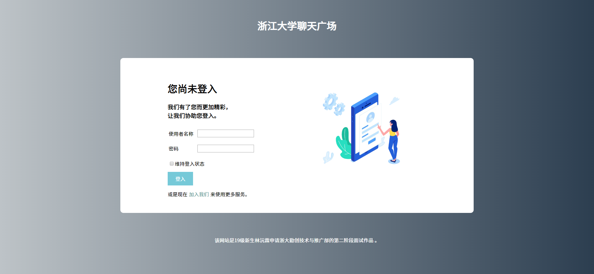

# ZJU-Square 浙江大学聊天广场

本网站为浙江大学 19级新生林沅霖参加浙大勤创技术推广部秋季纳新的第二阶段面试作品。

## 功能说明

本网站是一个即时通讯网页服务，注册账号后可在本网站与他人讯息交流。

## 前置需求

本网站需要安装与 PHP 网站服务器内使用，
且需要与 MySQL 数据库沟通，以执行其完整功能。

MySQL 的配置如下：

需要一个数据库，并将数据库地址、数据库使用者名称、数据库使用者密码以及数据库名称输入在 settings.php 内，
该数据库需要有两张资料表："users" 和 ”message”。

users 资料表用于储存网站使用者资料，其结构如下：

message 资料表用于储存网站使用者资料，其结构如下：

## 网页截图

登入画面

注册画面

主画面

登入画面 （自适应为手机版面）

注册画面 （自适应为手机版面）

主画面 （自适应为手机版面）

